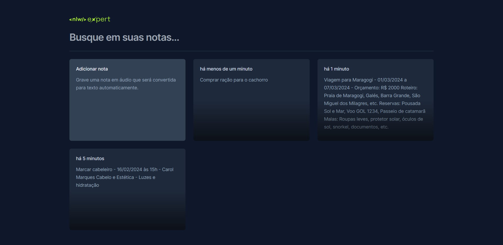

# NLW Expert Notes

NLW Expert Notes é um aplicativo web de notas que permite gravar notas em áudio ou digitar notas em texto. As notas em áudio são convertidas automaticamente para texto usando a API SpeechRecognition do navegador. As notas são salvas no localStorage do navegador e podem ser editadas ou excluídas.

O NLW Expert Notes foi desenvolvido durante a NLW Expert, a primeira NLW da Rocketseat de 2024. O projeto usa as seguintes tecnologias:

- Vite: Um moderno e rápido ferramenta de construção que melhora significativamente a experiência de desenvolvimento.
- React: Uma popular biblioteca JavaScript para construir interfaces de usuário, especialmente aplicações de página única.
- TypeScript: Adiciona verificação de tipo estático ao JavaScript, melhorando a qualidade e a manutenção do código.
- Tailwind CSS: Um framework CSS de utilidade que permite um rápido desenvolvimento de UI com classes de utilidade de baixo nível.
- Node: Um ambiente de execução JavaScript que permite executar código JavaScript fora do navegador.
- Radix: Uma biblioteca de componentes de design para React que segue os princípios do design system.
- SpeechRecognition API: Uma interface da Web Speech API que permite que você controle o serviço de reconhecimento de voz e manipule os dados de voz em suas aplicações web. Você pode usar essa API para reconhecer a fala do usuário a partir de uma entrada de áudio (normalmente através do serviço de reconhecimento de voz padrão do dispositivo) e responder adequadamente.

## Demo

Você pode ver uma demonstração do aplicativo no seguinte link: [NLW Expert Notes](^1^)

## Instalação

Para instalar o projeto localmente, você precisa ter o Node.js (versão 18 ou posterior) instalado. Em seguida, siga estes passos:
1. Clone o repositório do GitHub:

```bash
git clone https://github.com/valeriapessoa/nlw-expert-notes.git
```

2. Entre na pasta do projeto:

```bash
cd nlw-expert-notes
```

3. Instale as dependências:

```bash
npm install
```

4. Inicie o servidor de desenvolvimento:

```bash
npm run dev
```

5. Abra o navegador no endereço fornecido pelo Vite (geralmente http://localhost:5173).

## Uso

Para usar o aplicativo, você pode clicar no botão "Adicionar nota" e escolher entre gravar uma nota em áudio ou digitar uma nota em texto. Se você escolher gravar uma nota em áudio, você precisa dar permissão ao navegador para acessar o seu microfone e clicar no botão vermelho para iniciar a gravação. Quando terminar, clique no botão novamente para parar a gravação e ver a nota convertida em texto. Você pode editar o texto da nota se quiser.

As notas são exibidas em uma lista na página principal. Você pode clicar em uma nota para ver os detalhes, editar o texto ou excluí-la. Você também pode pesquisar notas por palavras-chave usando a barra de pesquisa.



